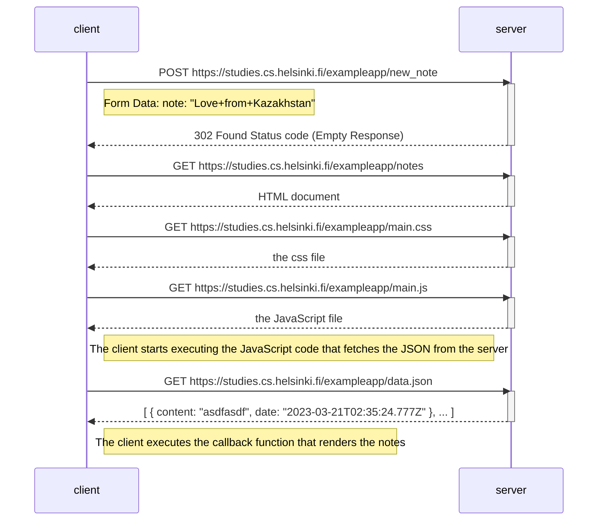

# The mermaid diagram for exercise 0.4

```mermaid
sequenceDiagram
    participant client
    participant server

    client->>server: POST https://studies.cs.helsinki.fi/exampleapp/new_note
    activate server
    Note right of client: Form Data: note: "Love+from+Kazakhstan"
    server-->>client: 302 Found Status code (Empty Response)
    deactivate server

    client->>server: GET https://studies.cs.helsinki.fi/exampleapp/notes
    activate server
    server-->>client: HTML document
    deactivate server

    client->>server: GET https://studies.cs.helsinki.fi/exampleapp/main.css
    activate server
    server-->>client: the css file
    deactivate server

    client->>server: GET https://studies.cs.helsinki.fi/exampleapp/main.js
    activate server
    server-->>client: the JavaScript file
    deactivate server

    Note right of client: The client starts executing the JavaScript code that fetches the JSON from the server

    client->>server: GET https://studies.cs.helsinki.fi/exampleapp/data.json
    activate server
    server-->>client: [ { content: "asdfasdf", date: "2023-03-21T02:35:24.777Z" }, ... ]
    deactivate server

    Note right of client: The client executes the callback function that renders the notes
```