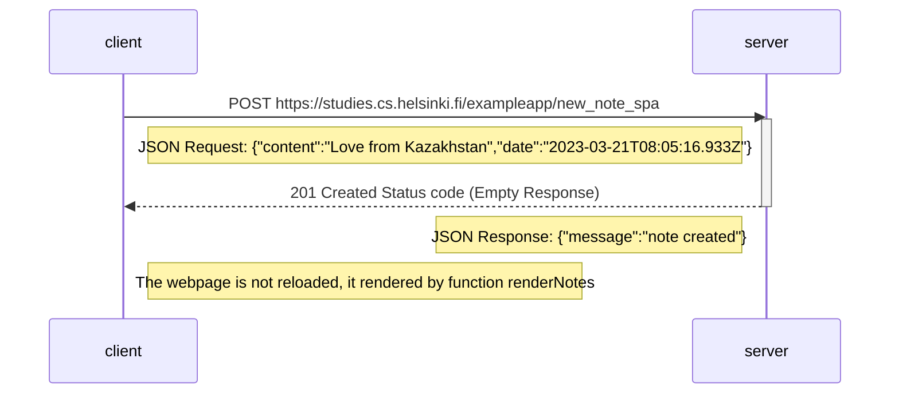

# The mermaid diagram for exercise 0.6

```mermaid
sequenceDiagram
    participant client
    participant server

    client->>server: POST https://studies.cs.helsinki.fi/exampleapp/new_note_spa
    activate server
    Note right of client: JSON Request: {"content":"Love from Kazakhstan","date":"2023-03-21T08:05:16.933Z"}
    server-->>client: 201 Created Status code (Empty Response)
    deactivate server
    Note left of server: JSON Response: {"message":"note created"}

    Note right of client: The webpage is not reloaded, it rendered by function renderNotes
```